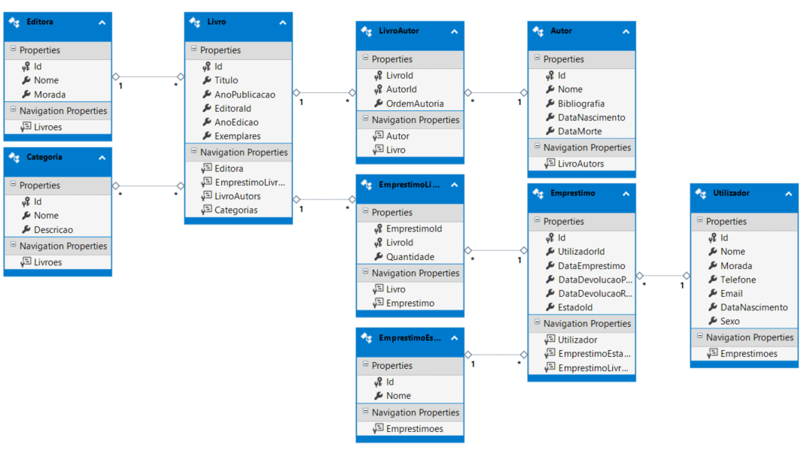

# Aplicativo Web ASP.NET (.NET Framework) 

## Análise de Requisitos para a criação de uma base de dados para uma Biblioteca Universitária

### Objetivo
O sistema tem como objetivo gerir o acervo bibliográfico de uma biblioteca universitária, controlando:
- Livros, autores, editoras e categorias
- Empréstimos e utilizadores
- Ter estatísticas de gestão de livros e empréstimos

### Requisitos Funcionais

#### 1. Gestão de Editoras
- Registar informações (nome, morada)
- Manter relação com livros publicados

#### 2. Gestão de Categorias
- Criar/manter categorias (nome, descrição)
- Associar livros a múltiplas categorias

#### 3. Gestão de Livros
- Cadastrar informações básicas (título, ano, edição, exemplares)
- Relacionar com editoras
- Permitir múltiplos autores com ordem de autoria
- Associar a múltiplas categorias
- Controlar estados (disponível, emprestado, reservado)
- Permitir pesquisa por título
- Gerar relatórios de estatísticas (número de livros, categorias, autores)

#### 4. Gestão de Autores
- Registrar dados (nome, bibliografia, datas)
- Relacionar com obras
- Permitir múltiplos autores por livro
- Controlar ordem de autoria
- Permitir pesquisa por nome

#### 5. Gestão de Utilizadores
- Cadastrar dados pessoais e de contato
- Controlar histórico de empréstimos
- Gerir estados de utilizadores (ativo, inativo)
- Permitir pesquisa por nome

#### 6. Gestão de Empréstimos
- Registrar operações (datas, estados)
- Controlar devoluções
- Gerenciar múltiplos itens por empréstimo
- Manter histórico de empréstimos
- Controlar estados (ativo, devolvido, atrasado)
- Permitir pesquisa por utilizador

### Requisitos Não Funcionais

| Categoria        | Especificação |
|------------------|---------------|
| Confiabilidade   | Alta disponibilidade e recuperação de falhas |
| Desempenho       | Resposta em < 3 seg mesmo com grandes volumes de informação |
| Disponibilidade  | 24/7, com manutenção planeada |
| Escalabilidade   | Suporte a crescimento de dados e utilizadores |
| Integridade      | Validação e consistência de dados |
| Manutenibilidade | Código modular e bem documentado |
| Portabilidade    | Compatível com diferentes sistemas operacionais e navegadores |
| Segurança        | Proteção de dados sensíveis  de acordo com as normas legais e autenticação de utilizadores |
| Usabilidade      | Interface intuitiva e responsiva |

### Modelo Entidade-Relacionamento

#### Entidades Principais
- **Editora** (publica livros)
- **Categoria** (classificação)
- **Livro** (entidade central)
- **Autor** (escritor)
- **Utilizador** (cliente)
- **EmprestimoEstado** (fluxo)
- **Emprestimo** (transação)

#### Relacionamentos
1. Editora (1) → Livro (N)
2. Livro (M) ↔ Autor (N)
3. Livro (M) ↔ Categoria (N)  
4. Utilizador (1) → Emprestimo (N)
5. EmprestimoEstado (1) → Emprestimo (N)
6. Emprestimo (M) ↔ Livro (N)

#### Atributos Especiais
- `OrdemAutoria`: Hierarquia de autores
- `Quantidade`: Itens por empréstimo
- `Estados`: Controle do ciclo de vida dos empréstimos

> **Nota**: Modelo bem normalizado com integridade referencial garantida por FK.

### Ficheiros para criação e preenchimento da base de dados
- :link: [DML (Data Definition Language)](DDL.sql "DDL")
- :link: [DML (Data Manipulation Language)](DML.sql "DDL")

### Estrutura das tabelas da Base de Dados SQL

 
### Estrutura das classes do DbContext criado pelo ORM 

> **Notas:** 
>	1. As classes do DbContext foram geradas automaticamente a partir do modelo de dados definido no Entity Framework, refletindo as entidades e seus relacionamentos.
>	1. A(s) Stored Procedure(s) são também importadas mas não aparecem no esquema do DBContext.